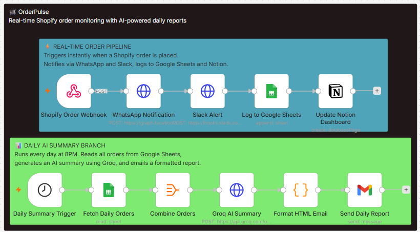

# OrderPulse

Real-time Shopify order monitoring system that instantly notifies via WhatsApp 
and Slack when an order is placed, logs all data to Google Sheets and Notion, 
and delivers an AI-generated daily summary report via Gmail.

---

## Overview



---

## What It Does

**Real-time pipeline (triggers on every order):**
- Receives Shopify order webhook instantly
- Sends WhatsApp notification to the business owner
- Posts order alert to Slack #orders channel
- Logs order details to Google Sheets
- Creates entry in Notion dashboard with status tracking

**Daily summary pipeline (runs every evening):**
- Reads all orders from Google Sheets
- Sends data to Groq AI for analysis
- Generates plain-English summary with total orders, revenue, and business insight
- Delivers formatted HTML report via Gmail

---

## Tech Stack

| Tool | Role |
|------|------|
| n8n (Docker) | Automation engine |
| Shopify (Dev Store) | Order source via webhook |
| WhatsApp Business API | Real-time order notifications |
| Slack | Internal team alerts |
| Google Sheets | Order logging and data storage |
| Notion | Live order dashboard |
| Groq AI | Daily summary generation |
| Gmail | Report delivery |
| ngrok | Webhook tunnel for local development |

---

## Workflow Structure
BRANCH 1 — Real-time (triggers on order)
Shopify Webhook → WhatsApp → Slack → Google Sheets → Notion

BRANCH 2 — Daily summary (8PM schedule)
Schedule Trigger → Google Sheets → Aggregate → Groq AI → Format HTML → Gmail

---

## Setup Instructions

### 1. Run n8n via Docker
```bash
docker run -it --rm \
  --name n8n \
  -p 5678:5678 \
  -v n8n_data:/home/node/.n8n \
  n8nio/n8n
```

### 2. Import workflow
Open `localhost:5678` → Workflows → Import → upload `ecommerce-order-intelligence.json`

### 3. Shopify
- Create a free dev store at `partners.shopify.com`
- Enable test data generation
- Register webhook: Settings → Notifications → Webhooks → Order creation → your n8n URL

### 4. WhatsApp
- Create app at `developers.facebook.com`
- Add WhatsApp product
- Get Phone Number ID and Access Token from API Setup page
- Add your number as verified recipient

### 5. Slack
- Create workspace and #orders channel
- Create app at `api.slack.com/apps`
- Enable Incoming Webhooks → copy webhook URL

### 6. Google Sheets
- Create sheet named `Shopify Orders`
- Columns: Order ID, Customer Name, Email, Total Price, Items, Date
- Connect via OAuth2 in n8n (requires Google Sheets API enabled in Google Cloud)

### 7. Notion
- Create database named `Orders`
- Properties: Order ID, Customer, Amount, Items, Date, Status
- Create integration at `notion.so/my-integrations` → connect to database

### 8. Groq AI
- Get free API key at `console.groq.com`
- Add as Header Auth in n8n: `Authorization: Bearer YOUR_KEY`

### 9. Expose webhook (local development)
```bash
ngrok http 5678
```
Use the generated https URL in your Shopify webhook settings.

### 10. Activate workflow
Toggle workflow to Published/Active in n8n.

---

## Sample Email Report

The daily Gmail report includes:
- Total orders received
- Total revenue
- Most ordered item
- AI-generated business insight

Formatted as a styled HTML email with green branding.

---

## Notes

- WhatsApp sandbox mode sends template messages only — production custom messages require Meta Business Verification
- ngrok URL changes on restart — update Shopify webhook URL each session
- Google Sheets and Drive APIs must both be enabled in Google Cloud Console
- Keep Docker running for scheduled triggers to fire

---

## Files

| File | Description |
|------|-------------|
| `OrderPulse.json` | Complete n8n workflow |
| `workflow-overview.png` | Canvas screenshot |


## ⚠️ Security Note
All credentials have been removed from the workflow JSON.
Replace placeholder values with your own API keys after importing.

---

*Built with n8n · Shopify · WhatsApp · Slack · Groq AI · Notion · Google Sheets*
